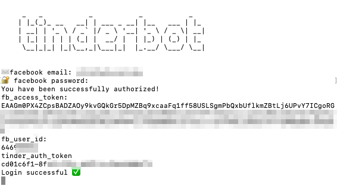
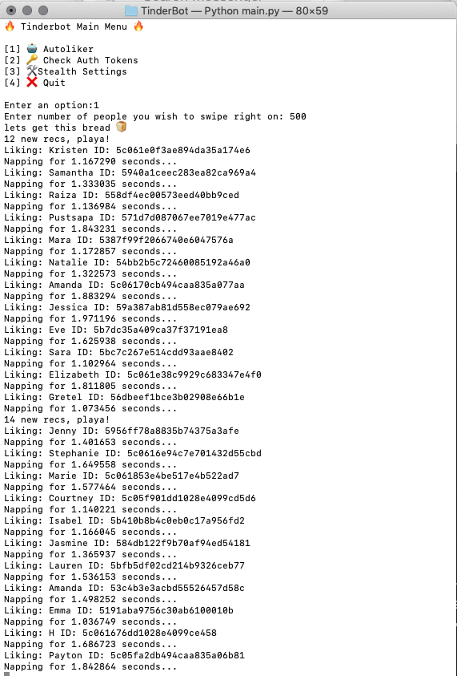

# Tinderbot

Proof of concept autoliker script that scrapes user profiles into a database for later analysis. 



## Installation

OS X & Linux & Windows with Docker:
```sh
docker build -t tinderbot .
docker run -it tinderbot
```

Native Python3:
```sh
pip install robobrowser requests bs4 config tinydb lxml
python3 main.py
```

## Quickstart

Once you launch the app, you'll be prompted for credentials. These are used by a robobrowser script to retrieve an Oauth token from Facebook to use with Tinder's API endpoint. Type in the full email address and password associated with its Facebook account.

Once authenticated, you can start the autoliker by pressing 1 then Enter.




## Silent Mode
TinderBot has the capability to stay on in the background, liking people throughout the day. By default, the bot will wait 20-40 minutes between bursts of likes and will cease after 8 hours. 

_To use silent mode, you need to first rename tinder_config_ex.py to config.py and populate the username and password fields_

Run Silent Mode:
```sh
python3 main.py s
```

Optionally, you can specific how many 'bursts' to complete before stopping:
```sh
python3 main.py s 15
```

A burst value of 999 will run perpetually:
```sh
python3 main.py 999
```

## How it works
BurpSuite write up and sample data can be found in the [docs](docs/tinder_api.md) folder

This app carries no warranty, and is for educational use only
