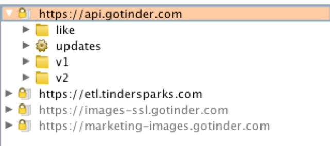
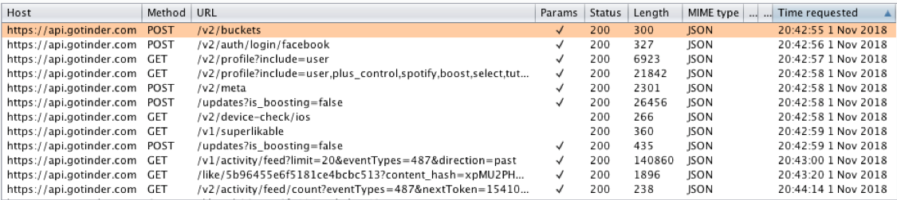

# Tinder 10.1 intercepted requests
> Endpoint discovery using BurpSuite

## Methodology

Before being able to send requests to the Tinder API, I needed to see how it communicates with the client. These are the steps I took and what I learned.

First, I needed to set up my environment:

1.  Burp Suite Community Edition installed
2.  Configure burp’s Proxy settings to listen on an open port across all interfaces
3.  Configure iPhone proxy manually to specified port and navigate browser to http://burp in order to install SSL certificate.
4.  Installed version 10.0.2 of Tinder from AppStore on iOS 12.0.1

Once this was done, I tested it by trying out a few HTTPS websites to verify BurpSuite was recording my requests. It wasn't tough to figure out their main endpoints:



After intercepting and stepping through each request, I began to form a picture of the control flow. It seems like after Tinder verifies the Oauth tokens, it downloads user data and a list of recommended users. 

This list holds user IDs, photo URLs, birthdates, locations, bios, distance, etc. Paydirt! Because this list is sent directly to the client without any obfuscation, we can clearly read and store this information. Check out [getRecSample.txt](getRecSample.txt) to check out a real life example (for extra fun, try opening any of the photo URLs in there. As it turns out, Tinder allows unauthenticated access to everyone's pictures!)

From this list, we can generate queries against any of the user ID's that we're given. After liking a few profiles on my phone, my captured requests looked like this:



After filtering out the unnecessary requests to CDNs and analytics brokers, we can see a pattern of requests that run every time the app starts up

```
POST /v2/buckets
POST /v2/auth/login/facebook
GET /v2/profile?include=user
POST /v2/meta
POST /updates?is_boosting=false
GET /v1/activity/feed?limit=20&eventTypes=487&direction=past
GET /like/5b96455e6f5181ce4bcbc513?content_hash=xpMU2PH...
POST /v2/meta
```

## Sample Intercepted Requests

Saving the intercepted requests here as reference for future features.

Request:
```
GET /v2/activity/feed/count?nextToken=15xxxxxxxx1_1xxxxxxxxd-xxxx-xxxx-xxxx-xxxxxxxxx-xxxxx:1xxxxxxxxxx_9xxxxx-xxxx-xxxx-xxxx-xxxxxxxx-001771&eventTypes=487 HTTP/1.1
Host: api.gotinder.com
X-Auth-Token: xxxxxxx-xxxx-xxxx-xxxx-xxxxxxxx
Accept: */*
Connection: close
platform: ios
os-version: 120000000001
x-client-version: 10010012
User-Agent: Tinder/10.1.0 (iPhone; iOS 12.0.1; Scale/2.00)
Accept-Language: en-us
app-version: 2597
Accept-Encoding: gzip, deflate
```

Response:
```
HTTP/1.1 200 OK
Content-Type: application/json;charset=utf-8
Date: Mon, 05 Nov 2018 10:05:54 GMT
X-Request-ID: b6sxxxxxxxx7sg
Content-Length: 61
Connection: Close

{"meta":{"status":200},"data":{"count":83,"pollInterval":60}}

Request:
POST /v2/buckets HTTP/1.1
Host: api.gotinder.com
Accept: */*
app-version: 2597
x-client-version: 10010012
Accept-Encoding: gzip, deflate
Accept-Language: en-us
platform: ios
Content-Type: application/json
Content-Length: 104
User-Agent: Tinder/10.1.0 (iPhone; iOS 12.0.1; Scale/2.00)
Connection: close
os-version: 120000000001

{"experiments":["sms_auth_v2","default_login_token"],"device_id":"xxxxxxxx-xxxx-xxxx-xxxx-xxxxxxxxxxxx"}
```

Response:
```
HTTP/1.1 200 OK
Content-Type: application/json; charset=utf-8
Date: Mon, 05 Nov 2018 10:05:55 GMT
Vary: Accept-Encoding
X-Request-ID: b6sxxxxxxxxxxxxb0
Content-Length: 99
Connection: Close

{"meta":{"status":200},"data":{"buckets":{"sms_auth_v2":"auth_v1","default_login_token":"legacy"}}}
```

Response:
```
HTTP/1.1 200 OK
Access-Control-Allow-Origin: *
Content-Type: application/json;charset=utf-8
Date: Mon, 05 Nov 2018 10:05:55 GMT
X-Request-ID: b6xxxxxxxxxxxx4g
Content-Length: 150
Connection: Close

{"data":{"token":"xxxxxxxx-xxxx-xxxx-xxxx-xxxxxxxx","ttlSeconds":14400,"timestamp":1541412355583,"position":3,"results":[]},"meta":{"status":200}}
```


